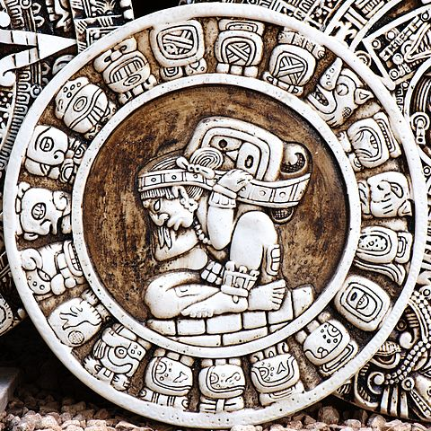

# tonal glyph tracker

Photo licensed under CC Attribution-Share Alike 2.0 Generic licensed Author: [theilr](https://www.flickr.com/people/theilr/)

A cross-platform music tracker

The project is still in its planning phase. I'm starting to get some good feedback. Any trackers out there wanna spec it out?d This repository is for sandbox testing and spec development. Check the specs folder!

## Goals

- Cross-platform at least Windows/Mac/Linux and hopefully webasm/emscripten
- Memory-safe, primarily through Rust's safety features
- Compatible with existing standards
- Embeddable in game engines/music applications
- Portable/serializable file formats

## Nice-to-haves but fraught with issues

- Able to import/play many module formats through libopenmpt/libxmp/oxidrizzle
- VST2/3, DSSI, LADSPA, LV2, AU plugin support
- A scripting API
- Internal synthesis and DSP
- MIDI, Sysex, and OSC support

## History

I first entered the demoscene in 1996 when I was fifteen where I made songs under the names gmork and bitsmart. I used Fasttracker II to take apart existing XM modules and make my own. Several years passed and I moved onto Madtracker 2. This is where VST plugins came into the picture and things got out of control. I have wanted since those years to make a tracker of my own. I am new to systems programming so I need all the help I can get for this project. Rust is still having some growing pains but that hasn't stopped me from being an early adopter of its philosophy. I feel free to write system-level code without worrying about making foolish beginners mistakes.

My design ideas are heavily influenced by the following great projects in no particular order: Fasttracker II, Madtracker 2, the Sonique music player and Night55, specifically Scirocco's music, Buzztracker/Buzztard/Buzé/Neil/Aldrin, Aodix/NoiseTrekker/Psycle/Renoise, SynthEdit, Synthmaker/Flowstone, SuperCollider, PureData, Sonic Pi, ChucK, Reaper and Reason.
